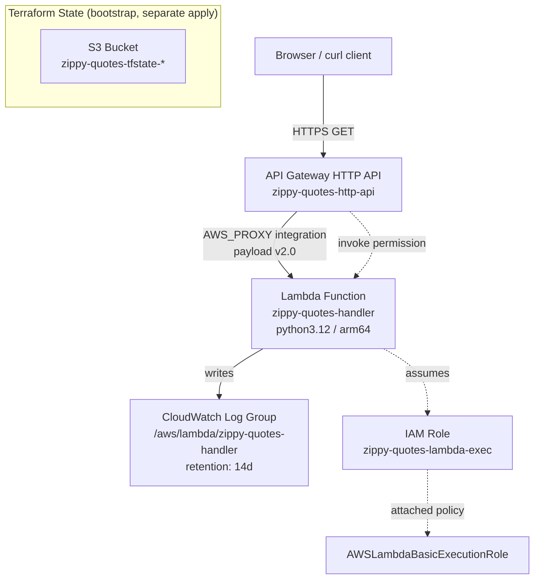

# Infrastructure Plan: Zippy Quotes API

**Goal**: `zippy-quotes-api`
**Workload classification**: Demo/Learning (low-traffic personal/demo site; optimize for near-zero idle cost over HA/scale)
**Author**: terraform-aws-planning (generated in-conversation after the dedicated planning agent's pinned model became unavailable)

> Note on versions: the Terraform Registry pages for `hashicorp/aws` and `terraform-aws-modules/lambda|apigatewayv2/aws` are JS-rendered and could not be scraped live in this session. Version constraints below use `~>` ranges known to be safe as of this writing; **run `terraform init` and check `registry.terraform.io` for the exact latest patch before first apply**, per the skill's own error-recovery guidance for provider/module drift.

---

## 1. Introduction

Deploy the existing `get_random_quote()` function (in [src/zippy/quotes.py](../src/zippy/quotes.py)) as a public website: a visitor hits a URL and gets a random Zippy-the-Pinhead quote, either as a simple HTML page (browsable) or as JSON (for API consumers). The current CLI (`src/zippy.py`) is not deployed as-is — a new Lambda handler wraps the same `get_random_quote()` logic.

**Architecture**: API Gateway (HTTP API) → Lambda (Python) → CloudWatch Logs, with Terraform state in S3. No VPC, no NAT, no database — the quote list is a static in-memory Python list, so there's nothing to persist at runtime.

**Response format decision**: one Lambda function serves two routes:
- `GET /` → minimal HTML page (so a browser visit reads as "a website")
- `GET /api/quote` → `{"quote": "..."}` JSON (so it's also usable as an API)

Routing is done inside the handler via `event["rawPath"]` — no need for two Lambdas.

---

## 2. Well-Architected Framework Alignment

| Pillar | How it shapes this plan |
|---|---|
| **Operational Excellence** | Single Terraform root module, no multi-env workspaces needed yet (one `demo` environment). `terraform fmt`/`validate`/`tflint` gate every change per the skill's standard workflow. |
| **Security** | Lambda execution role scoped to `AWSLambdaBasicExecutionRole` only (CloudWatch Logs writes) — no S3/DynamoDB data access needed since there's no runtime data store. API Gateway has no auth (public read-only quotes endpoint by design) but is HTTPS-only by default (API Gateway does not support plain HTTP). No secrets exist in this workload. |
| **Reliability** | Lambda + API Gateway HTTP API are inherently multi-AZ and managed — no extra HA config needed for a demo-tier static-content endpoint. |
| **Performance Efficiency** | `arm64` (Graviton2) Lambda architecture — cheaper and equal/better performance for this trivial CPU-bound workload than x86_64. 128 MB memory is ample (the handler does a `random.choice` over an in-memory list). |
| **Cost Optimization** | This is the dominant driver for a Demo/Learning workload — see §2a below. |
| **Sustainability** | Fully serverless: scales to zero, no idle compute, no always-on infrastructure. |

### 2a. Cost Optimization / "zero cost when idle" detail

- **Lambda**: pay-per-invocation + pay-per-GB-second. AWS free tier: 1M requests/month and 400,000 GB-seconds/month, forever (not just 12 months). A demo site with occasional traffic will very likely stay entirely within the free tier → **$0.00/month compute**.
- **API Gateway**: using **HTTP API** (`aws_apigatewayv2_api`), not REST API — HTTP API is ~71% cheaper ($1.00/million requests vs $3.50/million) and has no idle/hourly charge either way. Idle cost: **$0.00/month**.
- **CloudWatch Logs**: log group with `retention_in_days = 14` to cap storage growth; cost is negligible at demo volume (a few KB/day).
- **Terraform state backend**: S3 bucket for state — storage of a few KB of JSON costs a fraction of a cent/month. For locking, prefer **native S3 state locking** (`use_lockfile = true` in the `backend "s3"` block, available Terraform ≥ 1.11) over a DynamoDB table — this avoids a second resource entirely. If the installed Terraform version is older than 1.11, fall back to a DynamoDB table with `billing_mode = "PAY_PER_REQUEST"` (no hourly charge, cost is per-request and negligible at demo scale).
- **Explicitly avoided**: NAT Gateway (~$32/month + data), ALB (~$16/month + LCUs), RDS (hourly instance charge), VPC endpoints (hourly charge) — none are required since Lambda doesn't need VPC placement here (no private resources to reach).
- **Net result**: infrastructure cost at idle (zero traffic) is **effectively $0.00/month**, and stays in the low cents even under light demo traffic (thousands of requests/month).

### 2b. Lambda packaging strategy

Zero third-party pip dependencies (only stdlib `random`, plus a thin handler). This means:
- **Use a zip artifact** (`data.archive_file`), not a container image. Container images add ECR storage cost, a build/push step, and cold-start overhead — none of which buys anything here since there are no dependencies to bundle beyond the Python stdlib.
- Package `src/zippy/` (the `quotes.py` + `__init__.py` package) together with a new `lambda_handler.py` into the zip. `src/zippy.py` (the CLI) is *not* included in the deployment package — it's unrelated to the web handler.

---

## 3. Resources

### Architecture diagram



### Resource inventory

**Bootstrap layer** (`bootstrap/` — applied once, before the main config; own local state or a manually-created bucket, since state can't describe the bucket it lives in):

| # | Resource | Name | dependsOn |
|---|---|---|---|
| B1 | `aws_s3_bucket` | `zippy_quotes_tfstate` (`zippy-quotes-tfstate-<account_id>`) | — |
| B2 | `aws_s3_bucket_versioning` | on B1 | B1 |
| B3 | `aws_s3_bucket_server_side_encryption_configuration` | on B1, `AES256` | B1 |
| B4 | `aws_s3_bucket_public_access_block` | on B1, all four flags `true` | B1 |

**Main config** (`main/` — backend block points at B1, `use_lockfile = true` if Terraform ≥ 1.11, else add a `aws_dynamodb_table` with `billing_mode = "PAY_PER_REQUEST"`):

| # | Resource | Name | dependsOn |
|---|---|---|---|
| M1 | `data.archive_file` | `zippy_lambda_zip` — zips `src/zippy/` + new `lambda_handler.py` → `build/zippy_lambda.zip` | (source files) |
| M2 | `module "lambda_function"` (`terraform-aws-modules/lambda/aws`, `~> 7.0`, resolved 7.21.1) | `zippy-quotes-handler`, runtime `python3.12`, architectures `["arm64"]`, memory 128 MB, timeout 5s, `local_existing_package` pointed at the zip (module computes `source_code_hash` internally via `filebase64sha256` — do not pass it as an input, this version has no such variable), creates its own IAM role + `AWSLambdaBasicExecutionRole` attachment + log group internally | M1 |
| M3 | `aws_apigatewayv2_api` | `zippy-quotes-http-api`, `protocol_type = "HTTP"` | — |
| M4 | `aws_apigatewayv2_integration` | `AWS_PROXY`, `integration_uri = module.lambda_function.lambda_function_invoke_arn`, `payload_format_version = "2.0"` | M2, M3 |
| M5 | `aws_apigatewayv2_route` | `"GET /"` → M4 | M4 |
| M6 | `aws_apigatewayv2_route` | `"GET /api/quote"` → M4 | M4 |
| M7 | `aws_apigatewayv2_stage` | `"$default"`, `auto_deploy = true` | M3 |
| M8 | `aws_lambda_permission` | allows `apigateway.amazonaws.com` to invoke M2, `source_arn` scoped to M3's execution ARN | M2, M3 |

**Tags** (applied via `default_tags` on the `aws` provider block, per the skill's tagging convention, scaled down for demo): `Project = "zippy-quotes"`, `Environment = "demo"`, `ManagedBy = "terraform"`.

### Provider/module versions to verify at `terraform init`

```hcl
terraform {
  required_version = ">= 1.9.0"   # >= 1.11 if using native S3 state locking
  required_providers {
    aws = {
      source  = "hashicorp/aws"
      version = "~> 5.0"           # verify latest 5.x/6.x on registry.terraform.io before apply
    }
    archive = {
      source  = "hashicorp/archive"
      version = "~> 2.4"
    }
  }
}
```

---

## 4. Implementation Phases

1. **Phase 0 — Bootstrap state**: apply `bootstrap/` with local state to create the S3 bucket (B1–B4). One-time, rarely touched again.
2. **Phase 1 — Handler code** (implementation agent, in `src/`, not this planning file): add `src/lambda_handler.py` with a `handler(event, context)` that inspects `event["rawPath"]`, calls `zippy.quotes.get_random_quote()`, and returns either an HTML body (`/`) or a JSON body (`/api/quote`) with `statusCode` and appropriate `headers["content-type"]`.
3. **Phase 2 — Lambda + IAM** (`main/`): implement M1–M2. Validate with `terraform fmt`, `terraform validate`, `tflint` per the skill's standard workflow.
4. **Phase 3 — API Gateway**: implement M3–M8, wiring the integration to the Lambda's invoke ARN and locking down the permission's `source_arn`.
5. **Phase 4 — Outputs & plan/apply**: add an output `api_endpoint` (the stage's `invoke_url`), run `terraform plan -out=tfplan`, review, `terraform apply tfplan`.
6. **Phase 5 — Verify & teardown check**: `curl` both routes to confirm HTML/JSON responses; confirm CloudWatch log group receives entries; run `terraform destroy` in a scratch account/test cycle to confirm the whole stack (minus the state bucket) tears down to zero billable resources, validating the "easy to tear down to zero cost when idle" requirement.

---

## Related skill reference

Conventions (naming, tagging, module-first approach, `fmt`/`validate`/`tflint` gate, S3+lock state pattern) pulled from `.claude/skills/claude-skills-terraform-engineer/` (SKILL.md and references/best-practices.md, module-patterns.md, providers.md, state-management.md, testing.md), scaled down from its default (production, multi-account) assumptions to this Demo/Learning workload.
